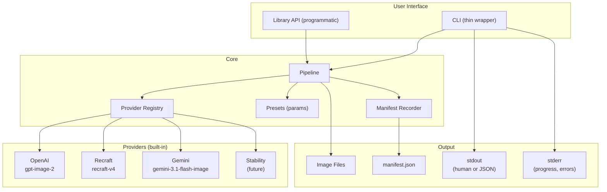
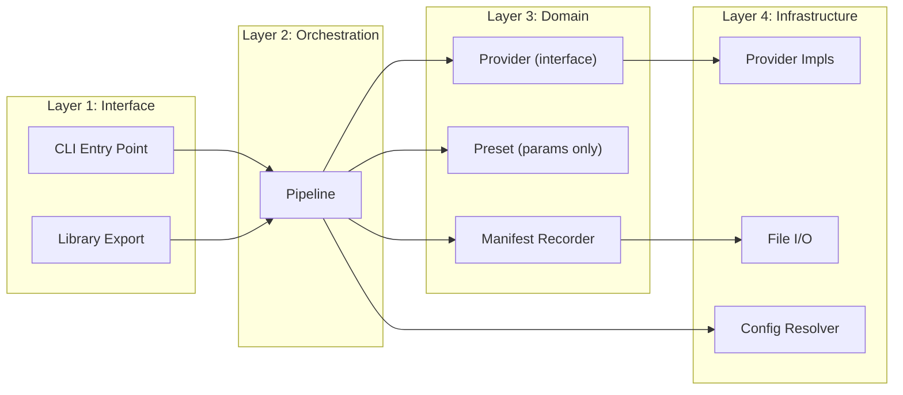
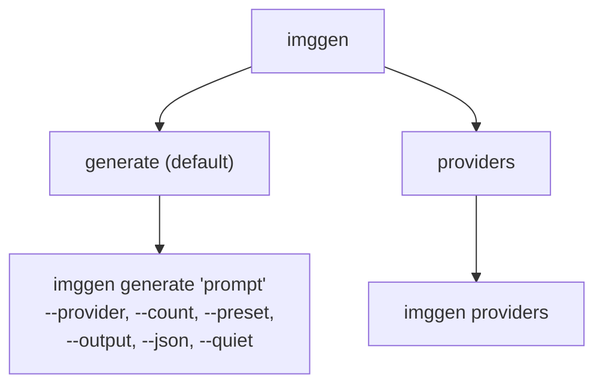
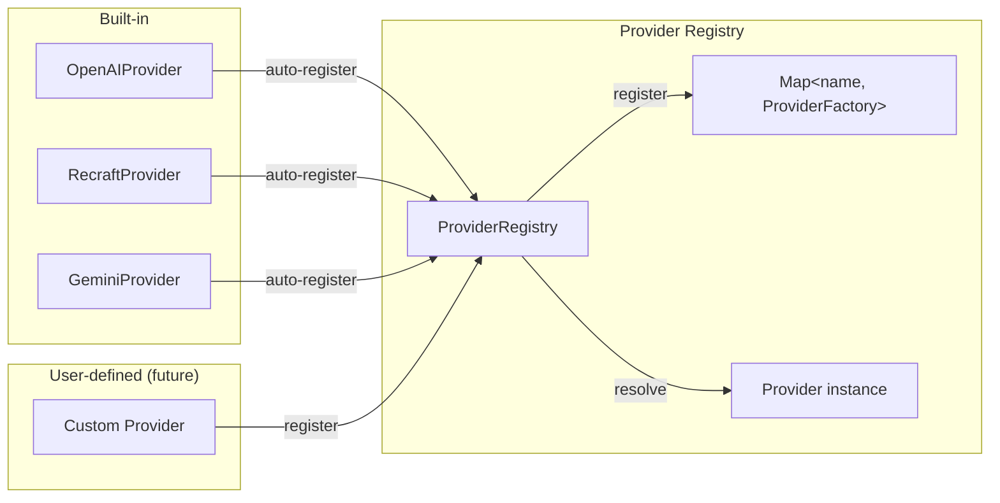
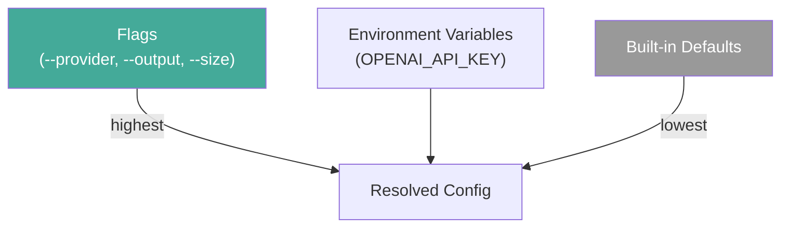
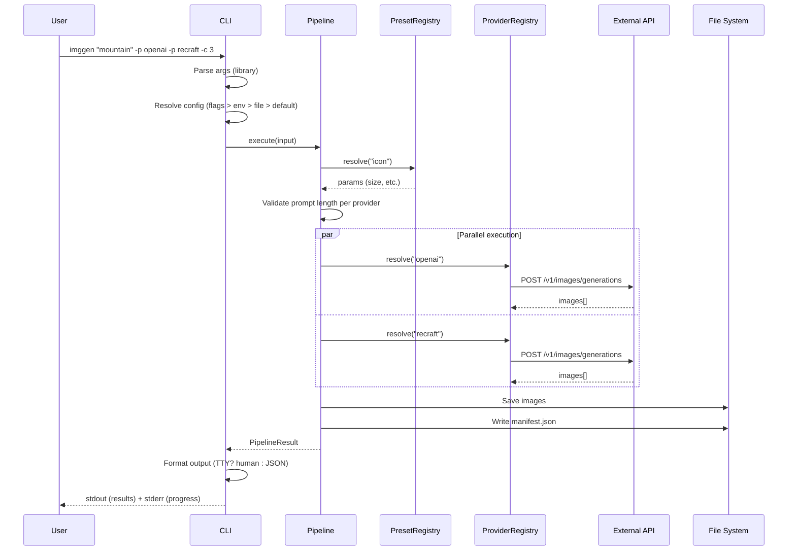
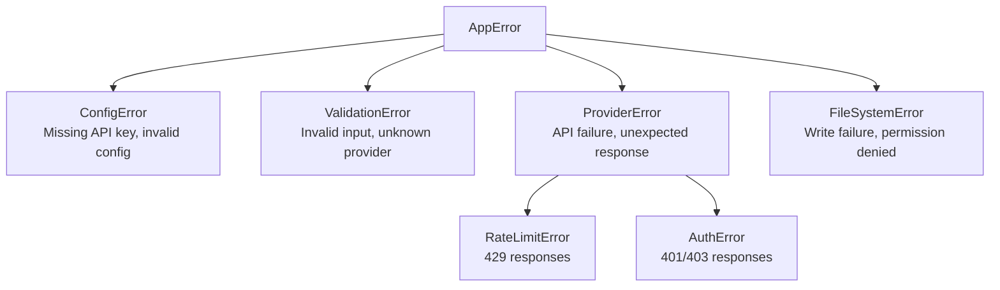

# ImgGenAI — Design Document

複数の AI 画像生成 API を統一インターフェースで扱う CLI + ライブラリ。

---

## What It Does

複数プロバイダへの並列生成 → 比較 → 選択のワークフローを、1コマンドで完結させる。

---

## Architecture Overview



---

## Layer Structure



**依存方向**: Interface → Orchestration → Domain ← Infrastructure。Domain 層は外部依存を持たない。

---

## CLI Design

### Command Structure



### Usage Examples

```bash
# Basic: generate with one provider
imggen generate "blue gradient mountain silhouette" --provider openai

# Short form: generate is the default subcommand
imggen "blue gradient mountain silhouette" -p openai

# Multiple providers in parallel (compare results)
imggen "blue gradient mountain silhouette" -p openai -p recraft -c 3

# With preset
imggen "blue gradient mountain" -p openai --preset icon -c 5

# JSON output (for piping)
imggen "mountain" -p openai --json | jq '.results[0].outputs'

# Multiple prompts via stdin (one per line)
cat prompts.txt | imggen -p openai -p recraft -c 2

# Compose with other commands
echo -e "mountain\nocean\nforest" | imggen -p openai

# List available providers
imggen providers
```

### Input Design (TTY / Pipe Duality)

| 入力元 | プロンプトの渡し方 |
|:--|:--|
| TTY（人間が直接叩く） | 位置引数で1プロンプト: `imggen "mountain" -p openai` |
| パイプ（stdin） | 行区切りで複数プロンプト: `cat prompts.txt \| imggen -p openai` |

- TTY かつプロンプト引数なし → ヘルプ表示して終了（ハングしない）
- パイプの場合、各プロンプトに対して独立した出力ディレクトリを生成

---

### Output Design (Human / Machine Duality)

**TTY (human-first)**:
```
Generating with openai, recraft (3 images each)...

  openai  ✓  3 images  2.1s
  recraft ✓  2 images  3.4s
           ✗  1 failed  "Rate limit exceeded"

Output: ./output/blue-gradient-mountain_20260407/
  openai_001.png  openai_002.png  openai_003.png
  recraft_001.png recraft_002.png

Total: 5 images, 3.4s
```

**Pipe / `--json`**:
```json
{
  "success": true,
  "outputDir": "./output/blue-gradient-mountain_20260407",
  "results": [
    {
      "provider": "openai",
      "model": "gpt-image-2",
      "success": true,
      "outputs": ["openai_001.png", "openai_002.png", "openai_003.png"],
      "duration": 2100
    }
  ]
}
```

### Flag Design

| Flag | Short | Description | Principle |
|:--|:--|:--|:--|
| `--provider <name>` | `-p` | Provider (repeatable) | §6 Flags over args |
| `--count <n>` | `-c` | Images per provider (default: 1) | §6 Standard names |
| `--preset <name>` | — | Preset name (exclusive with --size) | §6 |
| `--size <WxH>` | `-s` | Image size e.g. 1024x1024 (exclusive with --preset) | §6 |
| `--output <dir>` | `-o` | Output directory | §6 Standard names |
| `--json` | — | JSON output | §3 Duality |
| `--quiet` | `-q` | Suppress non-essential output | §3 Duality |
| `--no-color` | — | Disable colors | §3 Color control |
| `--debug` | `-d` | Show debug information | §5 Error design |
| `--dry-run` | `-n` | Show what would be done | §8 Interactivity |
| `--help` | `-h` | Help | §4 Self-documenting |
| `--version` | `-V` | Version | §4 |

### Exit Codes

| Code | Meaning |
|:--|:--|
| 0 | All providers succeeded |
| 1 | Some providers failed (partial success) |
| 2 | All providers failed |
| 3 | Invalid input (validation error) |
| 4 | Configuration error (missing API key etc.) |

---

## Provider System

### Interface

```typescript
interface Provider {
  readonly name: string;
  readonly models: string[];
  readonly maxPromptLength: number;  // chars (provider declares its limit)
  generate(request: GenerateRequest): Promise<GenerateResult>;
}
```

### Registry (Plugin Pattern)



ai-design の教訓: switch 文によるハードコードを避け、レジストリパターンで管理する。新プロバイダ追加はファイル追加 + レジストリ登録のみ。

```typescript
// providers/openai.ts
export default defineProvider({
  name: 'openai',
  models: ['gpt-image-2'],
  envKey: 'OPENAI_API_KEY',
  factory: (config) => new OpenAIProvider(config),
});
```

---

## Preset System

Preset は「よく使う生成パラメータの名前付きショートカット」。プロンプトには関与しない。

```yaml
# presets/icon.yaml
name: icon
description: "Square icon generation"
params:
  size: { width: 1024, height: 1024 }
```

```yaml
# presets/og-image.yaml
name: og-image
description: "OG image for social sharing"
params:
  size: { width: 1200, height: 630 }
```

```bash
imggen "blue mountain" -p openai --preset icon   # → 1024x1024
imggen "blue mountain" -p openai --preset og-image # → 1200x630
imggen "blue mountain" -p openai --size 512x512   # → 512x512 (直接指定)
imggen "blue mountain" -p openai                   # → provider default size
# --preset と --size は排他。両方指定するとエラー。
```

### Prompt Length Validation

Preset とは独立に、Pipeline が Provider の `maxPromptLength` でバリデーションを行う。

```
✗ Prompt too long for recraft (1,200 chars, max 1,000).
  Shorten the prompt.
```

---

## Configuration

### Hierarchy (§7)



### Credential Management

環境変数で管理する。各プロバイダ SDK の標準名をそのまま使う。

| Provider | Environment Variable |
|:--|:--|
| OpenAI | `OPENAI_API_KEY` |
| Recraft | `RECRAFT_API_TOKEN` |
| Gemini | `GEMINI_API_KEY` |

- フラグでは受け取らない (§6: ps/シェル履歴への漏洩防止)
- `.env` はツール側で読まない（ユーザーが direnv 等で管理する領域）

---

## Data Flow

### Generate Command



---

## Directory Structure

```
imggen/
├── src/
│   ├── cli/
│   │   ├── index.ts          # Entry point (bin)
│   │   ├── commands/
│   │   │   ├── generate.ts    # Default command
│   │   │   └── providers.ts   # providers list
│   │   └── output/
│   │       ├── human.ts       # TTY formatter
│   │       └── json.ts        # JSON formatter
│   │
│   ├── core/
│   │   ├── pipeline.ts        # Orchestration
│   │   ├── config.ts          # Config resolution
│   │   └── index.ts           # Library public API
│   │
│   ├── providers/
│   │   ├── index.ts            # Barrel + registerBuiltinProviders
│   │   ├── registry.ts        # Provider registry
│   │   ├── openai.ts
│   │   ├── recraft.ts
│   │   └── gemini.ts
│   │
│   ├── presets/
│   │   ├── index.ts            # Barrel export
│   │   └── registry.ts        # Preset registry (YAML loader 内蔵)
│   │
│   ├── manifest/
│   │   └── index.ts           # Manifest recorder
│   │
│   ├── errors/
│   │   └── index.ts           # Error hierarchy
│   │
│   └── types/
│       └── index.ts           # Shared types
│
├── presets/                    # Built-in preset files (YAML)
│   └── icon.yaml
│
├── package.json
├── tsconfig.json
└── README.md
```

---

## Package Design

```json
{
  "name": "imggenai",
  "bin": { "imggen": "dist/cli/index.js" },
  "exports": {
    ".": "dist/core/index.js",
    "./providers/*": "dist/providers/*.js"
  }
}
```

**二面性**: `npx imggen "prompt"` で CLI として使え、`import { Pipeline } from 'imggenai'` でライブラリとしても使える。

---

## Error Design (§5)



**エラーメッセージの原則** (§5):

```
✗ ConfigError: OPENAI_API_KEY is not set.

  Set it via environment variable:
    export OPENAI_API_KEY=sk-...
```

---

## Principles Compliance Matrix

設計の各要素が CLI Design Principles のどの原則に対応するか。

| Principle | How it's addressed |
|:--|:--|
| §1 Human-first | TTY で人間向け整形出力がデフォルト |
| §2 stdout/stderr 分離 | stdout=結果, stderr=進捗/エラー |
| §3 二面性 | TTY 自動検出 + `--json`, `--quiet`, `--no-color` |
| §4 ヘルプ | 引数パーサライブラリで自動生成 + 例を先頭に |
| §5 エラー設計 | 階層化エラー + 修正方法の提示 |
| §6 フラグ設計 | 標準名使用、短縮形提供、順序非依存 |
| §7 設定の階層 | flags > env > defaults |
| §8 対話性 | `--dry-run` 提供。TTY/パイプで入力方法を自動切替 |
| §9 速度 | API 呼び出し前にメッセージ、並列実行中はスピナー |
| §10 サブコマンド | noun verb パターン、フラグ名統一 |
| §11 堅牢性 | 入力検証（プロンプト長バリデーション含む）、API タイムアウト、部分失敗の許容 |
| §13 環境変数 | SDK 標準名を使用、秘密はフラグ不可 |
| §14 設定ファイル配置 | 現状不要。需要が見えた時点で XDG 準拠で追加 |
| §15 将来への備え | Provider/Preset のレジストリパターン |

### Lessons Applied

| Lesson | How it's addressed |
|:--|:--|
| A-1 学習分布への逆行 | ツールはユースケースに中立。プロンプトに関与しない |
| A-2 検証なしの作り込み | `--dry-run` で実行前確認。プロンプト長の事前バリデーション |
| B-1 プロバイダのハードコード | レジストリパターン。switch 文なし |
| B-3 手書き引数パーサ | ライブラリ使用 |
| B-4 テンプレートのコード埋め込み | Preset はパラメータのみ。プロンプトテンプレート自体を廃止 |
| C-1 特定呼び出し元の前提 | CLI が第一。Library API が第二 |
| C-2 dotenv 依存 | dotenv を使わない。環境変数を直接読む |
